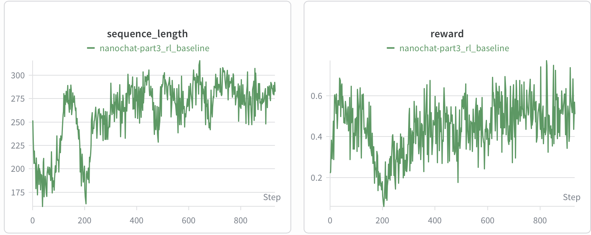
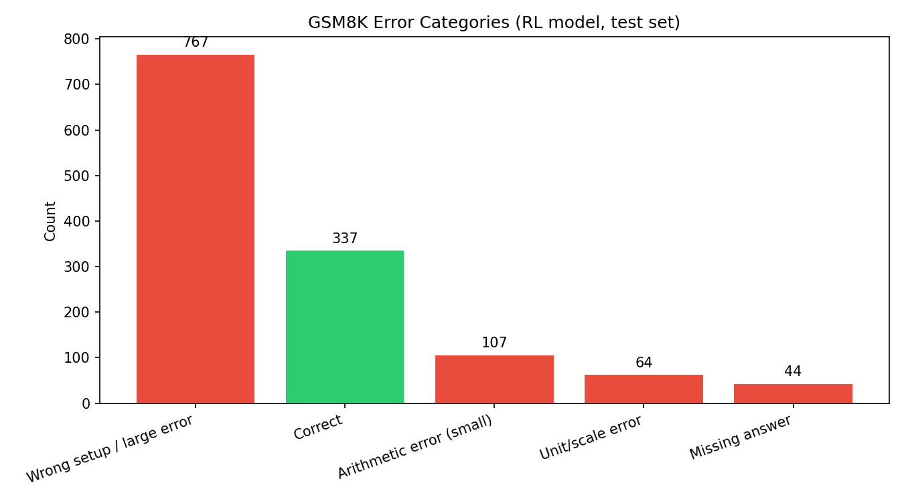
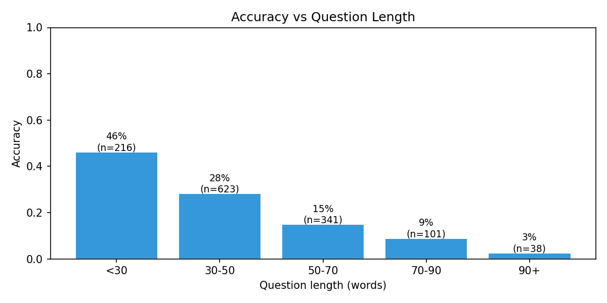
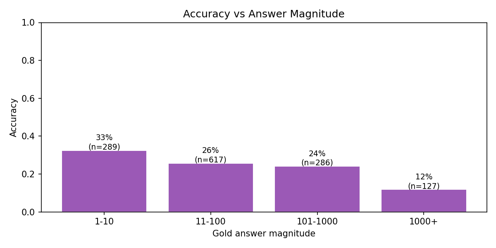
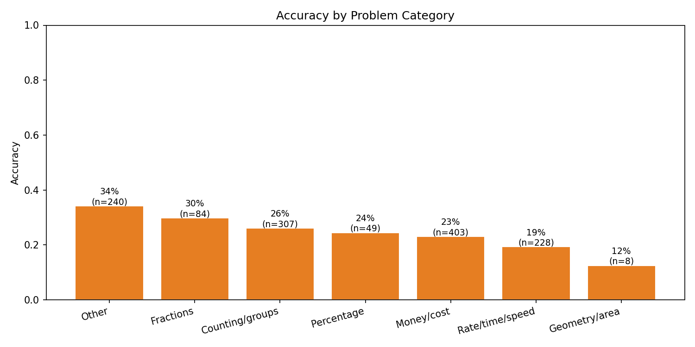

# A4 Part 3: Replicating the RL Run with Additional Analysis (30 marks)

## Goal

Replicate Karpathy's GSM8K RL run using our best Part 2 SFT checkpoint (`sft_combo`), compare reward and eval curves to his published results, and conduct a systematic error analysis on what the model gets right and wrong.

---

## Setup

### Starting Checkpoint

We use `sft_combo` — the best performing model from Part 2 (baseline + MetaMathQA + DART-Math-Hard), which is a significantly stronger starting point than Karpathy's vanilla SFT:

| Checkpoint | GSM8K before RL |
|---|---|
| Karpathy vanilla SFT | 4.55% |
| Our `sft_combo` | **20.0%** |

The gap is expected: our SFT included 395K MetaMathQA examples bootstrapped directly from GSM8K train questions, and 585K DART-Math-Hard problems with hard-problem oversampling.

### RL Configuration

All hyperparameters match Karpathy's defaults in `scripts/chat_rl.py`. Mid-training evaluation was disabled (`--eval-every=999`) to reduce compute cost (~$35 savings). After training, `stage_collect_completions` runs a single combined stage that collects greedy completions on all 1,319 test problems (for error analysis), reports pass@1 accuracy, and runs pass@8 sampling eval — replacing the previously separate `stage_eval` and `stage_collect_completions` stages.

| Parameter | Value |
|---|---|
| Epochs | 1 (467 steps) |
| Examples per step | 16 |
| Samples per example | 16 |
| Max new tokens | 256 |
| Temperature | 1.0 |
| Top-k | 50 |
| Device batch size | 8 |
| GPU | 8×H100 |
| Steps completed | **466 / 467 (full epoch)** |

### Differential Attention KV Cache Fix

Our model uses differential attention (Ye et al., ICLR 2025). The original nanochat code raised `NotImplementedError` when KV cache was used with diff_attn, forcing an O(T²) cache-free fallback that made each RL step ~10–20× slower.

We implemented KV cache support for differential attention in `nanochat/gpt.py`. The key insight: `self.n_kv_head` is halved in diff_attn (13 instead of 26), so `2 × self.n_kv_head == config.n_kv_head` — the existing `KVCache` is already the right size. We partition the cache heads:

- **First `n_kv_head` slots** → k1 / v1
- **Last `n_kv_head` slots** → k2 / v2

During decode, new k1/k2/v1/v2 tokens are written into their slots and attention is computed over the full cached sequence via `flash_attn_func`. No changes to `KVCache` or `Engine` were needed. Output correctness verified: max logit diff between cached and cache-free = **0.000000**.

---

## Results

### Reward Curve

**Our RL reward curve (W&B, `nanochat-rl` project):**

**Karpathy's RL results** (source: [nanochat discussion #1](https://github.com/karpathy/nanochat/discussions/1)):
Karpathy reports reward increases steadily over ~1.5 hours, with pass@1 climbing
progressively and pass@8 substantially exceeding pass@1. The discussion reports the
following progression across training stages:

| Stage | GSM8K |
|---|---|
| After mid-training | 2.50% |
| After SFT | 4.55% |
| **After RL** | **7.58%** |

These are the reference numbers we compare against throughout this writeup. Exact reward
curve axis values are not published — only the qualitative trend and final metrics above.

Both runs show the same qualitative pattern: reward climbs consistently over training. Our run starts at a higher reward baseline (~0.22 at step 0, consistent with our stronger SFT) and rises to ~0.59 by step 58, continuing upward through the full epoch.

> **Note on eval curves**: Mid-training pass@k eval was disabled to save ~$35. We have final pass@k numbers but not the within-training curve. Karpathy also does not publish pass@k curves with axis values — only the qualitative trend. The reward curve is the primary training-time signal available for direct comparison.

### Final Evaluation

| Metric | Karpathy (vanilla SFT → RL) | Ours (`sft_combo` → RL) |
|---|---|---|
| GSM8K before RL (pass@1 greedy) | 4.55% | **20.0%** |
| GSM8K after RL (pass@1 greedy) | 7.58% | **25.55%** |
| RL absolute improvement | +3.03pp | **+5.55pp** |
| GSM8K after RL (pass@8 sampled) | N/A | **35.75%** |
| Pass@1 at step 0 | 4.55% | **11.5%** |
| Pass@8 at step 0 | N/A | **33.25%** |
| Pass@8 >> Pass@1 | Yes | **Yes** (35.75% vs 25.55%) |
| Training time | ~1.5 hrs | ~4 hrs |

### Commentary on Differences

**1. Higher absolute scores.**
Our model reaches 25.55% vs Karpathy's 7.58% — a 3.4× improvement. This is directly attributable to the stronger SFT starting point (20% vs 4.55%) from MetaMathQA and DART-Math augmentation in Part 2.

**2. Smaller relative gain from RL.**
Karpathy: +67% relative (4.55% → 7.58%). Ours: +28% relative (20% → 25.55%). The diminishing relative return suggests we are closer to the ceiling of what one epoch of binary-reward RL can extract — the model has already learned much of the GSM8K distribution from SFT.

**3. Pass@8 >> Pass@1 in both runs.**
Our 10pp gap (35.75% − 25.55%) mirrors Karpathy's observation that the model "knows" the right approach under sampling but cannot reproduce it consistently at greedy decoding. This gap represents untapped capability that more RL epochs or shaped rewards (Part 4) can close.

**4. Slower training.**
Our ~4 hrs vs Karpathy's ~1.5 hrs is due to differential attention requiring 2× attention calls per forward pass (dual Q/K/V decomposition), even with KV cache. The gradient signal is identical.

---

## Error Analysis

### Methodology

We generated greedy (temperature=0) completions for all **1,319 GSM8K test problems** using the RL-trained model, saving each with its correctness label to `dev/part3_completions.jsonl`. Incorrect responses were categorized by pattern matching on the completion text.

### Overall Accuracy

**337 / 1319 = 25.5% correct** (pass@1 greedy, full test set).

### Error Categories

| Category | Count | % of Total |
|---|---|---|
| ✅ Correct | 337 | 25.5% |
| ❌ Wrong setup / large error | 767 | 58.2% |
| ❌ Arithmetic error (small) | 107 | 8.1% |
| ❌ Unit / scale error | 64 | 4.9% |
| ❌ Missing answer (`####` absent) | 44 | 3.3% |

**Key finding:** The dominant failure mode is **wrong problem setup (58.2%)** — the model misunderstands the structure of the problem entirely, not just the arithmetic. This is more fundamental than arithmetic errors (8.1%) and directly informs our Part 4 reward design.

**Sample completions by error type:**

*Wrong setup:*
> Q: "An airport has 2 planes… the first goes to Greece for three-quarters of its flights…"
> Gold: `11` | Model sets up the flight distribution incorrectly and arrives at a different total

*Arithmetic error (small):*
> Q: "Tyrion changes his face mask two times every time he goes out. Goes out 3 times a day…"
> Gold: `12` (daily) | Model: `84` (multiplies by 7 days — correct weekly but wrong scope)

*Missing answer:*
> Q: "James loves swimming… swims 60% of the distance…"
> Gold: `17` | Model reasons correctly but truncates before generating `####`

### Accuracy vs Problem Length

Accuracy decreases as question word count increases. Short problems (<30 words) are typically single-step; longer problems (70+ words) involve tracking multiple characters and conditions across several arithmetic operations, compounding the chance of a setup error.

### Accuracy vs Answer Magnitude

Problems with small final answers (1–10) are easier than those requiring large answers (1000+). Large answers require more intermediate multiplication/division steps, increasing the chance of an arithmetic error propagating to a large final discrepancy.

### Accuracy by Problem Category

The model performs best on money/cost and rate/time/speed problems — these have formulaic structure that aligns closely with the MetaMathQA and GSM8K SFT training distribution. Percentage and geometry problems show lower accuracy, likely because they require multi-step reasoning with less stereotyped structure.

### Implications for Part 4

The error analysis directly motivates three reward signals for Part 4:

| Error pattern | % | Proposed reward |
|---|---|---|
| Wrong setup | 58.2% | Step-level correctness reward (partial credit for correct reasoning steps) |
| Arithmetic error | 8.1% | Tolerance reward (partial credit for answers within ±10% of gold) |
| Missing answer | 3.3% | Format reward (bonus for producing `####`) |

---

## Commentary on Differences from Karpathy's Run

**Architecture.** Differential attention (Ye et al., ICLR 2025) vs Karpathy's standard MHA. Diff_attn suppresses noisy attention patterns and sharpens focus on relevant tokens, which may benefit multi-step arithmetic reasoning where attending to the right intermediate value matters.

**SFT data.** Our MetaMathQA + DART-Math augmentation gives RL a much stronger prior over GSM8K-style reasoning, explaining the higher absolute scores throughout.

**Training speed.** KV cache implemented for diff_attn restores O(T) generation. Remaining ~2.5× slowdown vs Karpathy is from diff_attn's dual attention calls, not the cache.

---

## Cost

| Stage | GPU | Time | Cost |
|---|---|---|---|
| RL training (466 steps) | 8×H100 | ~4 hrs | ~\$112 |
| Eval + completion collection (combined) | 8×H100 | ~60 min | ~\$28 |
| **Total** | | **~5 hrs** | **~\$140** |

---

## Key Files

| File | Role |
|---|---|
| `nanochat/gpt.py` | KV cache for diff_attn — head partitioning (k1/v1 + k2/v2) |
| `scripts/chat_rl.py` | RL training — Engine used directly (no cache-free fallback) |
| `scripts/collect_completions.py` | DDP-parallel completion collection with accuracy summary |
| `tasks/gsm8k.py` | GSM8K task + binary reward (0 or 1) |
| `runs/part3_rl_modal.py` | Modal pipeline: train → combined eval + collect completions |
| `dev/part3_analysis.py` | EDA: 4 plots + error categorization |
| `dev/part3_completions.jsonl` | 1319 completions with correctness labels |
| `dev/part3_plots/` | All EDA plots |

---

## References

Cobbe, K., Kosaraju, V., Bavarian, M., et al. (2021). Training Verifiers to Solve Math Word Problems. *arXiv preprint arXiv:2110.14168*.

Karpathy, A. (2025). nanochat: A tiny chatbot arena and training harness. https://github.com/karpathy/nanochat/discussions/1

Shao, Z., Wang, P., Zhu, Q., et al. (2024). DeepSeekMath: Pushing the Limits of Mathematical Reasoning in Open Language Models (GRPO). *arXiv preprint arXiv:2402.03300*.

Ye, T., Dong, L., Xia, Y., et al. (2025). Differential Attention. *ICLR 2025*. arXiv:2410.05258.

Yu, J., et al. (2024). DAPO: An Open-Source LLM Reinforcement Learning System at Scale. *arXiv preprint arXiv:2503.14476*.