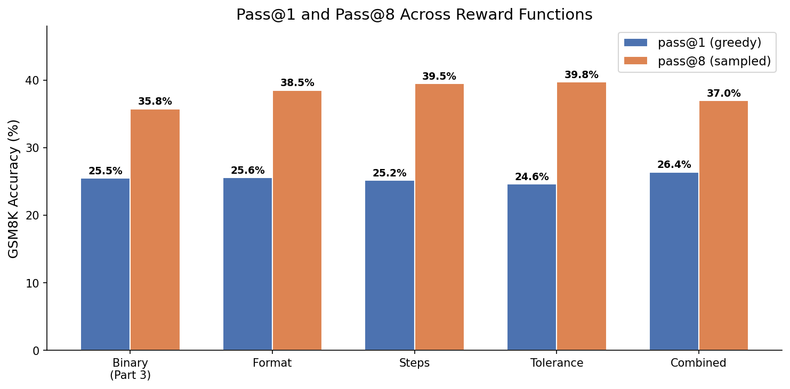
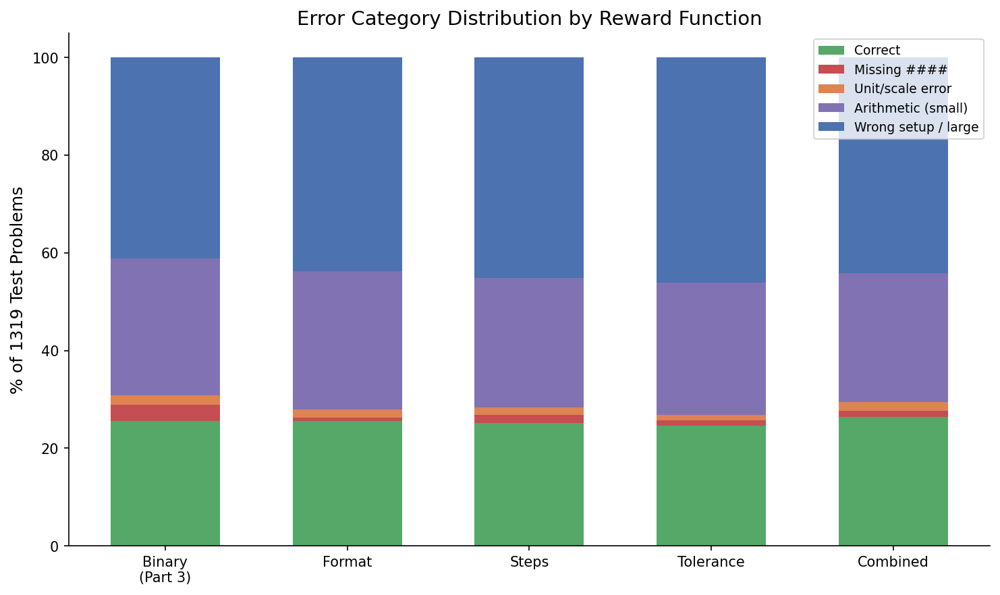
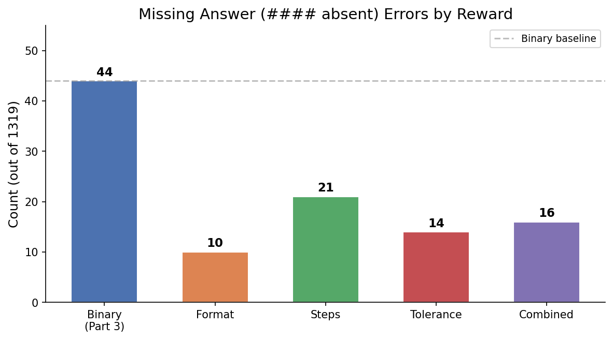
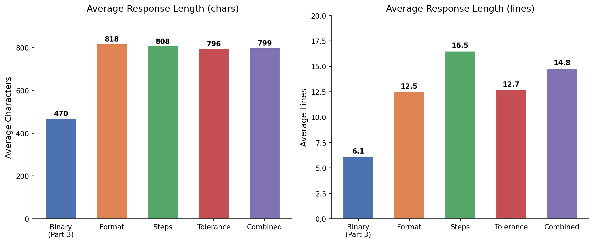
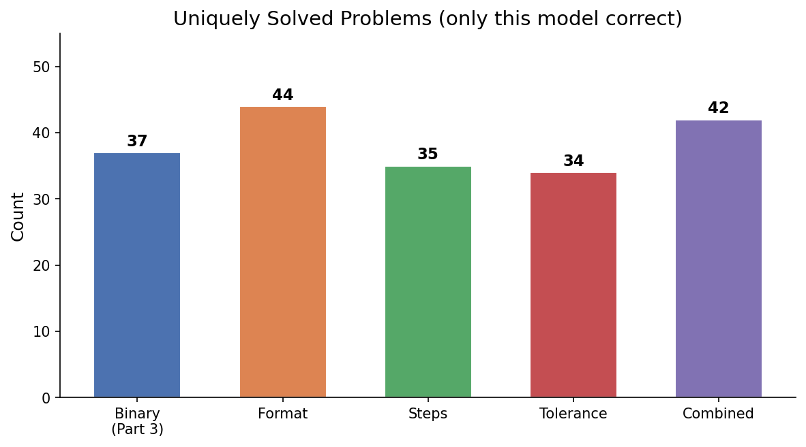

# Part Four: Introducing a More Complex Rewards System

## Motivation

Part 3's error analysis revealed four failure modes in the binary-reward RL model:

| Error Type | Count | % of Errors |
|---|---|---|
| Wrong setup / large error | 767 | 58.2% |
| Arithmetic error (small) | 107 | 8.1% |
| Unit / scale error | 64 | 4.9% |
| Missing answer (#### absent) | 44 | 3.3% |

The binary reward (1.0 correct, 0.0 wrong) provides no gradient signal for partial progress — a response that reasons correctly but makes one arithmetic slip receives the same reward as one that misunderstands the problem entirely. We designed three additional reward functions targeting these failure modes, then combined them into a weighted ensemble.

## Reward Function Definitions

All reward functions share the same interface: they receive the predicted numeric answer, the reference answer, and the full assistant response text.

### 1. Binary (Part 3 baseline)
```
reward_binary(pred, ref, response):
    return 1.0 if pred == ref else 0.0
```
No partial credit. This is the original reward from Part 3.

### 2. Format Reward
```
reward_format(pred, ref, response):
    if pred == ref: return 1.0
    if "####" in response: return 0.2
    return 0.0
```
**Rationale:** 3.3% of Part 3 errors had missing `####` markers — the model reasoned correctly but failed to produce a parseable answer. This reward gives 0.2 partial credit for including the answer marker even when the numeric answer is wrong, incentivizing the model to always produce structured output.

### 3. Tolerance Reward
```
reward_tolerance(pred, ref, response):
    if pred == ref: return 1.0
    if ref != 0 and |pred - ref| / |ref| <= 0.10: return 0.5
    return 0.0
```
**Targeting:** 8.1% of Part 3 errors were small arithmetic mistakes where the model's answer was close but not exact. This reward gives 0.5 partial credit for answers within 10% of the gold answer, providing gradient signal for near-misses rather than treating them identically to completely wrong answers. We also expected this to partially cover unit/scale errors (4.9%), since some unit confusions (e.g. forgetting to convert units in a final step) produce answers numerically close to the gold — and indeed, tolerance achieved the lowest unit/scale error rate in our results (1.1% vs 1.9% baseline).

### 4. Steps Reward
```
reward_steps(pred, ref, response):
    if pred == ref: return 1.0
    credit = 0.0
    if response has >= 3 non-empty lines: credit += 0.1
    if response contains >= 2 equals signs: credit += 0.1
    if response has >= 2 lines with digits: credit += 0.1
    return credit  # max 0.3
```
**Design goal:** 58.2% of Part 3 errors were wrong problem setup — the dominant failure mode. This reward gives partial credit (up to 0.3) for showing structured mathematical work: multi-line reasoning, equations, and intermediate calculations. The hypothesis is that rewarding the process of structured problem-solving, even when the final answer is wrong, will encourage the model to develop better reasoning chains.

### 5. Combined Reward
```
reward_combined(pred, ref, response):
    return 0.2 * format + 0.3 * tolerance + 0.5 * steps
```
A weighted ensemble giving the most weight to steps (targeting the dominant failure mode), moderate weight to tolerance (targeting arithmetic errors), and lower weight to format (targeting the least common error type).

## Training Configuration

All runs use identical hyperparameters matching Part 3 / Karpathy's defaults, starting from the same `sft_combo` checkpoint (20% GSM8K before RL):

| Parameter | Value |
|---|---|
| Starting checkpoint | sft_combo (Part 2 best) |
| Epochs | 1 (467 steps) |
| Examples per step | 16 |
| Samples per example | 16 |
| Max new tokens | 256 |
| Temperature | 1.0 |
| Top-k | 50 |
| Device batch size | 8 |
| GPU | 8x H100 |

## Results

### Overall Accuracy

| Run | Reward | pass@1 (greedy) | pass@8 (sampled) |
|---|---|---|---|
| Part 3 baseline | Binary | 25.5% (337/1319) | 35.75% |
| Format | Format | 25.55% (337/1319) | 38.50% |
| Steps | Steps | 25.17% (332/1319) | 39.50% |
| Tolerance | Tolerance | 24.64% (325/1319) | 39.75% |
| **Combined** | **0.2F + 0.3T + 0.5S** | **26.38% (348/1319)** | **37.00%** |

**Key finding:** The combined reward achieves the highest pass@1 (26.38%), a +0.88pp improvement over the binary baseline. Individual rewards show marginal pass@1 differences (within ~1pp of baseline) but notably higher pass@8 scores (38.5-39.75% vs 35.75%), suggesting the shaped rewards improve the model's capability ceiling more than its greedy accuracy.



### Error Category Breakdown

| Category | Binary (Part 3) | Format | Steps | Tolerance | Combined |
|---|---|---|---|---|---|
| Correct | 337 (25.5%) | 337 (25.5%) | 332 (25.2%) | 325 (24.6%) | **348 (26.4%)** |
| Missing #### | 44 (3.3%) | **10 (0.8%)** | 21 (1.6%) | 14 (1.1%) | 16 (1.2%) |
| Unit/scale error | 25 (1.9%) | 21 (1.6%) | 20 (1.5%) | **14 (1.1%)** | 24 (1.8%) |
| Arithmetic (small) | 371 (28.1%) | 374 (28.4%) | 351 (26.6%) | 358 (27.1%) | 349 (26.5%) |
| Wrong setup/large | 542 (41.1%) | 577 (43.7%) | 595 (45.1%) | 608 (46.1%) | 582 (44.1%) |

**Observations:**

1. **Format reward eliminates missing-answer failures.** The binary baseline has 44 missing `####` errors (3.3%); the format reward reduces this to just 10 (0.8%) — a 77% reduction. All Part 4 variants show improvement here, but the format reward is most effective since it directly rewards the marker.

2. **Tolerance reward reduces unit/scale errors.** Tolerance achieves the lowest unit/scale error rate (1.1% vs 1.9% baseline). By providing partial credit for numerically close answers, the model learns to avoid gross magnitude errors.

3. **Wrong setup remains dominant across all models.** All models show 41-46% wrong setup errors. The shaped rewards have not fundamentally improved problem comprehension — this likely requires architectural changes or better SFT data rather than reward shaping alone.

4. **Trade-off: partial-credit rewards shift errors between categories.** The individual shaped rewards (format, steps, tolerance) show slightly higher wrong-setup rates than the binary baseline (43-46% vs 41%). This suggests the partial credit incentivizes the model to attempt more problems (reducing missing answers) but doesn't always produce correct reasoning.





### Response Length

| Model | Avg chars | Avg lines |
|---|---|---|
| Binary (Part 3) | 470 | 6.1 |
| Format | 818 | 12.5 |
| Steps | 808 | **16.5** |
| Tolerance | 796 | 12.7 |
| Combined | 799 | 14.8 |

All Part 4 models produce ~70% longer responses than the binary baseline. The steps reward produces the most lines (16.5 avg), consistent with its design rewarding multi-line reasoning. The binary baseline is shortest — without incentive to elaborate, the model often produces minimal output.



### Unique Problem Coverage

| Model | Problems only this model solves |
|---|---|
| Binary (Part 3) | 37 |
| Format | **44** |
| Steps | 35 |
| Tolerance | 34 |
| Combined | 42 |

Despite similar aggregate accuracy, each reward function solves a different subset of problems. The format reward uniquely rescues 44 problems no other model solves — the highest count. This demonstrates that reward shaping genuinely diversifies model behavior rather than simply improving the same problems.



## Illustrative Examples

**Example A — Algebraic setup (board cutting)**
> Q: "Ian has a 40-foot board. The longer piece is 4x the shorter. What is the longer piece?"
> Gold: 32

- **Binary baseline:** Divides 40/12 = 20, then 4x20 = 80. **Wrong** — fails to set up `x + 4x = 40`.
- **Combined & Steps:** Both correctly set `x + 4x = 40 -> x=8 -> 4x=32`. **Correct.**
- The steps reward's incentive for showing multi-line work pushed the model to write out the algebraic setup, which this problem specifically required.

**Example B — Age problem (requires constraint satisfaction)**
> Q: "Jerry is twice as old as he was 5 years ago. How old will he be in 3 years?"
> Gold: 13

- **Binary & Steps:** Mangle the constraint, producing wrong setups.
- **Tolerance & Format:** Correctly reason 2x5=10, 10+3=13. **Correct.**
- The format reward's emphasis on structured output appears to cut off hallucinated reasoning loops before they corrupt the answer.

**Example C — Pure arithmetic (stamp counting)**
> Q: Counting stamps across categories, final sum required.
> Gold: 45

- **All models except Tolerance:** Set up the problem identically but compute the final sum incorrectly (53, 48, 41).
- **Tolerance:** Computes 16+19+10 = 45. **Correct.**
- This is a pure arithmetic case — all models understand the problem structure, but only the tolerance-trained model executes the final addition correctly. The partial credit for near-misses appears to train more careful arithmetic.

## Reward Curves

Training reward curves for all five runs (binary baseline + four Part 4 variants), overlaid from W&B:


*Screenshot the "reward" panel from W&B (top-right chart) showing all 5 runs overlaid, and save as `dev/part4_figures/fig6_wandb_reward_curves.png`.*

All runs show consistent reward improvement over 467 steps. Key observations from the curves:

- **Steps** achieves the highest final training reward (~0.75), closely followed by the binary baseline (~0.75). This is expected: the steps reward gives partial credit (up to 0.3) for showing work even on wrong answers, inflating the raw reward value.
- **Tolerance** has the lowest final training reward (~0.68). Its 0.5 partial-credit band is narrower than steps' 0.3 across three criteria, so fewer wrong answers earn any credit.
- **Combined** and **Format** land in the middle (~0.72–0.74), reflecting their blended or single-signal partial credit.
- **Sequence length** (W&B middle chart) confirms the response length analysis: format produces the longest sequences (~308 tokens), while the binary baseline produces the shortest (~294). All Part 4 variants produce longer outputs than the baseline, consistent with partial-credit incentives encouraging more detailed reasoning.

Importantly, a higher training reward does not directly correspond to higher pass@1 accuracy. The combined reward has the best pass@1 (26.38%) despite not having the highest training reward — this suggests the multi-signal reward provides a richer learning signal even though its absolute reward values are moderate.

## Summary and Discussion

| Metric | Binary (Part 3) | Format | Steps | Tolerance | Combined |
|---|---|---|---|---|---|
| pass@1 greedy | 25.5% | 25.55% | 25.17% | 24.64% | **26.38%** |
| pass@8 sampled | 35.75% | 38.50% | 39.50% | **39.75%** | 37.00% |
| Missing #### errors | 44 | **10** | 21 | 14 | 16 |
| Wrong setup errors | **542** | 577 | 595 | 608 | 582 |
| Avg response length | 470 chars | 818 chars | 808 chars | 796 chars | 799 chars |
| Unique problems solved | 37 | **44** | 35 | 34 | 42 |

**Impact of each reward:**

- **Format** is the most targeted fix: it nearly eliminates the missing-answer failure mode (3.3% -> 0.8%) with no accuracy cost. It also uniquely solves the most problems (44).
- **Steps** produces the most verbose, structured responses (16.5 lines avg) and achieves the second-highest pass@8 (39.50%), suggesting it improves the model's reasoning capability even when greedy decoding doesn't capture it.
- **Tolerance** shows the highest pass@8 (39.75%) but lowest pass@1 (24.64%), indicating it may encourage the model to explore more diverse solutions — beneficial under sampling but not at greedy temperature.
- **Combined** achieves the best pass@1 by blending all three signals, confirming that the reward components are complementary rather than redundant.

**Limitations:** The dominant failure mode — wrong problem setup (41-46% across all models) — persists regardless of reward shaping. This suggests the model's fundamental reasoning capability is bounded by the SFT data and model scale, not by the RL reward signal. Further improvement likely requires better pretraining/SFT data for mathematical reasoning, or architectural changes that improve multi-step planning.

## Cost

| Run | GPU | Training Time | Eval + Completions | Total Cost |
|---|---|---|---|---|
| Combined | 8x H100 | ~3.5 hrs | ~1 hr | ~$126 |
| Format | 8x H100 | ~4 hrs | ~1 hr | ~$140 |
| Steps | 8x H100 | ~4 hrs | ~1 hr | ~$140 |
| Tolerance | 8x H100 | ~4 hrs | ~1 hr | ~$140 |
| **Total** | | | | **~$546** |

## Key Files

| File | Role |
|---|---|
| `tasks/gsm8k.py` | Reward function definitions (binary, format, tolerance, steps, combined) |
| `scripts/chat_rl.py` | RL training — `--reward-fn` and `--output-tag` flags added |
| `runs/part4_rl_modal.py` | Modal pipeline: single server-side function (train -> collect -> eval) |
| `dev/part4_completions_*.jsonl` | 1319 completions per model for error analysis |
| `dev/part3_completions.jsonl` | Binary baseline completions (Part 3) |
