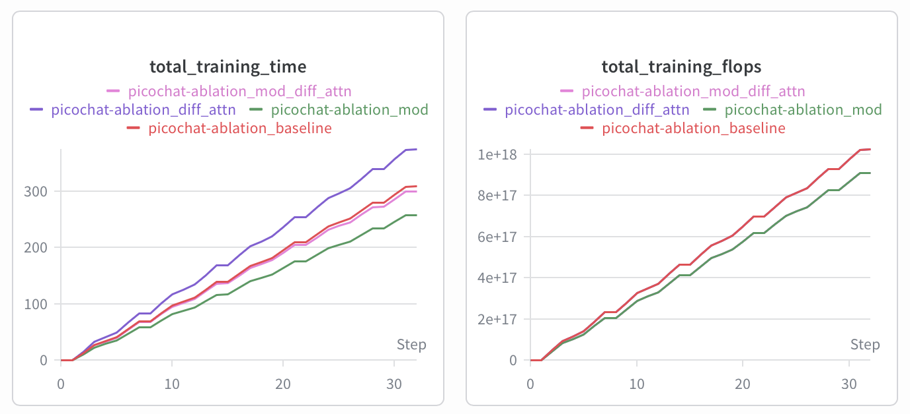
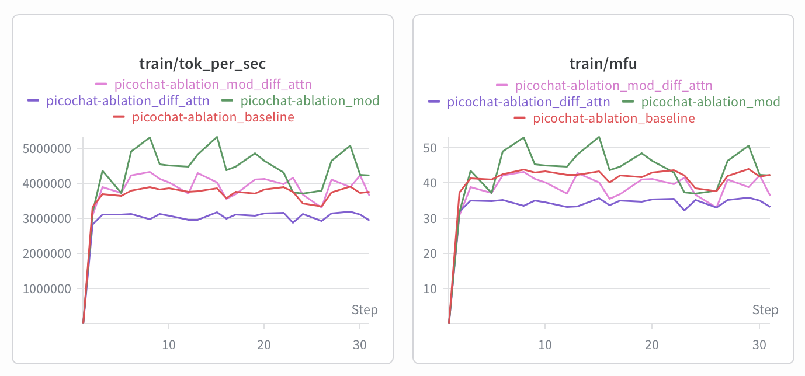
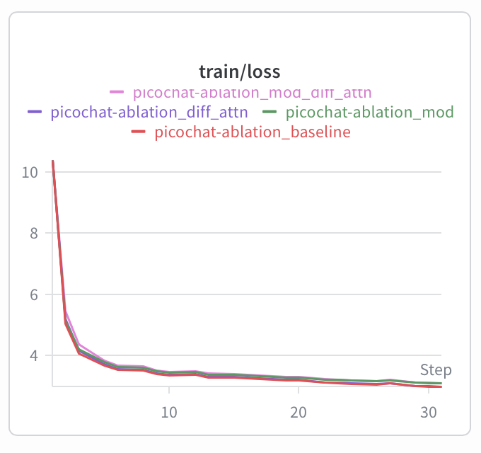
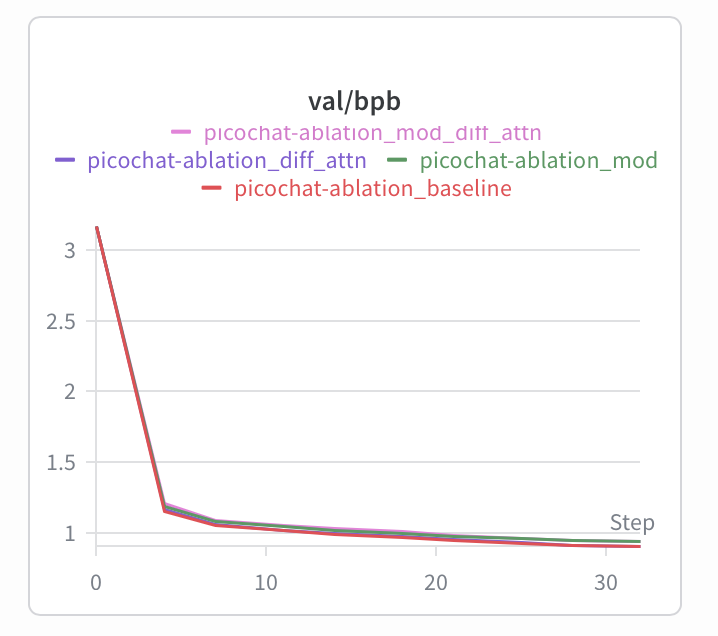

# Part 2: Ablations on a Nano Nanochat

## Overview

We select two architecture changes — **Mixture of Depths (MoD)** (Raposo et al., arXiv 2404.02258) and **Differential Attention** (Ye et al., ICLR 2025) — and evaluate them on a small nanochat configuration we call **picochat**. Both required real implementation in `gpt.py`. We train four models: a baseline, each change in isolation, and a combined run, comparing val_bpb and CORE score at d=12.

The two modifications have different design goals. **MoD** is an efficiency technique: at iso-parameter count, it reduces total training FLOPs by ~11% (measured), enabling faster wall-clock training and higher token throughput with a fixed model size. The evaluation question for MoD is whether this efficiency gain comes at an acceptable quality cost. **Differential Attention** targets quality directly: same compute, better attention selectivity. Its evaluation is straightforwardly quality-focused.

---

## Picochat Configuration

We define picochat as a depth=12 nanochat model:

| Hyperparameter | Value | Rationale |
|---|---|---|
| `--depth` | 12 | Matches GPT-2 small depth (Radford et al., 2019); ~85M non-embedding params; large enough for a meaningful training signal while small enough to train in ~40 min on 8×H100 |
| `--aspect-ratio` | 64 | nanochat default; model_dim = 12 × 64 = 768 |
| `--head-dim` | 64 | 768/64 = 12 heads |
| `--window-pattern` | L | Full attention; appropriate for short sequences |
| `--device-batch-size` | 16 | Matches reference speedrun config |
| Training horizon | Chinchilla (10.5×) | Automatically computed from parameter count (Hoffmann et al., 2022) |
| Data | 80 FineWeb-EDU shards | Comfortable headroom over the ~20 shards needed for Chinchilla-optimal at ~85M params |
| GPU | 8×H100 train / 4×H100 eval | Matches reference speedrun; 4×H100 for eval halves cost |

**Justification for d=12:** Preliminary d=8 runs validated the pipeline and showed the expected quality gap. d=12 matches GPT-2 small's depth (Radford et al., 2019) and provides a better training signal for evaluating architectural effects.

---

## The Four Models

### Model 1: pico_baseline
**Config:** d=12, model_dim=768, 12 heads, ReLU², standard per-layer attention and MLPs.

The control model. Identical to the Feb 2026 nanochat architecture at this scale. All other models are compared against this checkpoint.

### Model 2: pico_mod
**Config:** d=12, model_dim=768, 12 heads, ReLU², **Mixture of Depths routing**.

Implements Mixture of Depths (Raposo et al., arXiv 2404.02258). Even-indexed layers (0, 2, 4, …) use a learned scalar router to select the top `capacity = 12.5%` of tokens; those tokens are processed through attention + MLP while the rest skip the layer via the residual. Odd-indexed layers run at full capacity. At d=12, 6 of 12 layers are MoD layers.

```python
# In Block.forward() for MoD layers:
router_weights = self.mod_router(x).squeeze(-1)       # (B, T) scalar scores
_, top_indices = torch.topk(router_weights, capacity, dim=1)
sorted_positions, _ = torch.sort(top_indices, dim=1)  # sort for causal RoPE correctness

x_sel = x.gather(1, gather_e)                         # gather selected tokens
x_out = x_sel + attn(norm(x_sel), ...)
x_out = x_out + mlp(norm(x_out))

weighted_delta = router_w_sel * (x_out - x_sel)
x = x.scatter_add(1, gather_e, weighted_delta)        # scatter back
```

The router logit doubles as an interpolation scalar: `x[pos] += r * delta`. Router weights are zero-initialized so MoD layers are transparent at step 0 (weighted_delta = 0), and routing is learned gradually.

**FLOP reduction:** Each MoD layer operates on 12.5% of tokens for both attention and MLP projections, reducing per-layer compute by ~87.5%. With half the layers being MoD layers, the theoretical savings are ~44% of layer compute — but embeddings, norms, the LM head, and the router all run at full capacity, bringing the measured total FLOP reduction to ~11% (8.676×10¹⁸ vs 9.767×10¹⁸, from W&B). The evaluation question is whether this efficiency gain comes at an acceptable quality cost.

Parameter count is approximately equal to baseline (~85M) — the router adds only `n_embd` parameters per MoD layer (6 × 768 = ~4.6K), negligible at this scale.

### Model 3: pico_diff_attn
**Config:** d=12, model_dim=768, **6 super-heads**, head_dim=64, ReLU², **Differential Attention**.

Differential Attention (Ye et al., ICLR 2025) computes two softmax attention maps per head and subtracts one from the other. The difference cancels attention noise and focuses on relevant tokens. `n_head` is halved so total output dimension stays equal to `n_embd`; V is doubled to `2 × head_dim` per KV head, preserving the same total KV dimension as the baseline.

```python
# Per super-head:
A1 = softmax(q1 @ k1.T / sqrt(d)) @ v
A2 = softmax(q2 @ k2.T / sqrt(d)) @ v
y  = A1 - λ * A2
# λ = exp(lq1·lk1).clamp(-10,10) - exp(lq2·lk2).clamp(-10,10) + λ_init
# λ_init = 0.8 - 0.6 * exp(-0.3 * layer_idx)
```

Output is normalized per-head with a no-param RMSNorm and scaled by `(1 - λ_init)`. Parameter count is approximately equal to the baseline (~85M) since the halved head count and doubled V dimension cancel out.

### Model 4: pico_mod_diff_attn
**Config:** d=12, model_dim=768, **6 super-heads**, head_dim=64, ReLU², **MoD routing + Differential Attention**.

Both modifications applied simultaneously: even-indexed layers use MoD routing (12.5% capacity) with differential attention; odd-indexed layers use full-capacity differential attention. This tests whether the two changes interact constructively or destructively — the combined model has the same ~85M parameter count as baseline (router adds ~4.6K params, negligible).

---

## Training Setup

All models trained on Modal, 8×H100, 80 FineWeb-EDU shards, shared BPE tokenizer (2B chars). Tracked with Weights & Biases under `picochat-ablation`. Training horizon set automatically by Chinchilla ratio (`--target-param-data-ratio=10.5`).

```bash
# Local smoke test (~5 min)
bash runs/runpico_test.sh

# Cloud training (full pipeline)
modal run runs/pico_ablation_modal.py

# Individual stages
modal run runs/pico_ablation_modal.py::stage_pretrain_baseline
modal run runs/pico_ablation_modal.py::stage_pretrain_mod
modal run runs/pico_ablation_modal.py::stage_pretrain_diff_attn
modal run runs/pico_ablation_modal.py::stage_pretrain_mod_diff_attn
modal run runs/pico_ablation_modal.py::stage_eval
```

---

## Results

| Model | Attn | Params | Total FLOPs | val_bpb ↓ | CORE ↑ | Δbpb | ΔCORE |
|---|---|---|---|---|---|---|---|
| pico_baseline | Standard | ~85M | 9.767×10¹⁸ | **0.9252** | **0.1140** | — | — |
| pico_mod | Standard + MoD | ~85M | 8.676×10¹⁸ (−11%) | 0.9598 | 0.1016 | +3.7% | −10.9% |
| pico_diff_attn | Differential | ~85M | 9.767×10¹⁸ | 0.9260 | 0.1051 | +0.1% | −7.8% |
| pico_mod_diff_attn | Differential + MoD | ~85M | 8.677×10¹⁸ (−11%) | 0.9627 | 0.0754 | +4.1% | −33.9% |
| GPT-2 target | — | ~1.5B | — | ~0.748 | 0.2565 | — | — |

All models are at ~85M parameters. Total FLOPs from W&B `total_training_flops`. CORE scores at picochat scale are well below the GPT-2 threshold (0.2565); relative differences are what matter.

---

## Commentary

**Mixture of Depths (pico_mod).** MoD achieved its efficiency goal — ~11% fewer total training FLOPs at identical parameter count (8.676×10¹⁸ vs 9.767×10¹⁸) — at a quality cost of +3.7% bpb and −10.9% CORE. The measured reduction is lower than the theoretical ~44% savings from skipping 87.5% of tokens in half the layers because embeddings, layer norms, the LM head, and the router itself all run at full capacity regardless of routing decisions. Raposo et al. (2024) validated MoD under *isoFLOP* conditions, where saved FLOPs were reinvested into a larger model; under iso-parameter conditions, degradation is expected. The cost is larger than desirable for quality-sensitive use cases: 12.5% capacity is aggressive at d=12 (only 256 of 2048 tokens processed per MoD layer), the router gradient signal is weak at 85M params, and skipped tokens miss nanochat's value embedding modulation. For latency- or cost-constrained deployment the efficiency gain is real; for quality-sensitive applications the trade-off is unfavorable at this scale.

**Differential Attention (pico_diff_attn).** DiffAttn showed negligible bpb change (+0.1%) but a meaningful CORE drop (−7.8%). The root cause is nanochat's mandatory QK-norm: the Muon optimizer drives Q/K weight norms upward during training, requiring QK-norm for bfloat16 stability. QK-norm homogenises the magnitude distributions of q1, q2, k1, k2, making the two attention maps A1 and A2 more correlated — reducing the dynamic range that `A1 − λ·A2` relies on. Ye et al. (2025) trained without QK-norm; their differential mechanism exploits free variation in Q/K norms across heads and layers, a degree of freedom that Muon removes. The CORE penalty may be scale-dependent: at d=26, lambda saturation (toward 0.8 in deeper layers) gives the differential weighting more leverage, and 13 super-heads reduce the attention diversity bottleneck. The near-zero bpb penalty makes DiffAttn the stronger candidate for a larger run.

**Combined (pico_mod_diff_attn).** bpb degradation is approximately additive (+4.1%); CORE degradation is 81% worse than additive expectation (−33.9% vs −18.5% predicted). MoD routes 87.5% of tokens past even-indexed layers, so the differential attention mechanism in those layers operates on only 256 tokens — too few for meaningful subtraction, nullifying both the routing and differential benefits simultaneously.

**These results are not refutations of the original papers.** Both methods were validated under substantially different conditions (isoFLOP for MoD; AdamW without QK-norm for DiffAttn). The key finding is that architectural modifications are not always portable across training recipes: the Muon + QK-norm combination creates constraints that change how these modifications behave.


---

## W&B Visualisation

Training runs tracked under `picochat-ablation`. Key plots:

**Figure 1: Training time and total FLOPs vs step**



Two pairs of lines overlap: baseline (red) and diff_attn (purple) are nearly identical in total FLOPs, confirming that differential attention adds negligible compute overhead at matched parameter count. Similarly, mod (green) and mod_diff_attn (pink) overlap, showing that combining MoD with differential attention produces the same ~11% FLOP reduction as MoD alone — the differential attention overhead is absorbed by the token-sparse MoD layers. The gap between the two pairs confirms the ~11% measured reduction from MoD routing.

**Figure 2: Throughput and hardware utilisation (tok/sec, MFU)**



MoD (green) sustains the highest tok/sec and MFU due to token-sparse computation on even-indexed layers. DiffAttn (purple) has the lowest throughput, consistent with its higher per-step compute cost.

**Figure 3: Train loss**



All four models converge smoothly with no instability or NaN events. Curves are closely grouped throughout training, consistent with the small absolute differences in final quality.

**Figure 4: Validation BPB**



The baseline (red) achieves the lowest final val/bpb. The absolute differences (0.001–0.037 bpb) are small relative to the y-axis range; final values should be read from the results table above. MoD (green) and MoD+DiffAttn (pink) diverge slightly from the baseline in the later steps, consistent with the reported +3.7% and +4.1% bpb gaps.

---

## Cost of Training

| Item | Time | GPUs | Cost |
|---|---|---|---|
| Data + tokenizer | ~10 min | CPU / 1×H100 | ~$5.30 |
| pico_baseline (d=12, Chinchilla) | ~40 min | 8×H100 | ~$18.70 |
| pico_mod (d=12, Chinchilla) | ~40 min | 8×H100 | ~$18.70 |
| pico_diff_attn (d=12, Chinchilla) | ~40 min | 8×H100 | ~$18.70 |
| pico_mod_diff_attn (d=12, Chinchilla) | ~40 min | 8×H100 | ~$18.70 |
| Eval: bpb + CORE (×4 models) | ~120 min | 4×H100 | ~$28.00 |
| **Total** | **~290 min** | | **~$108** |

*Pricing: Modal H100 on-demand (~$3.50/GPU/hr × 8 = $28/hr node, $14/hr for 4×H100).*

**Credit efficiency decisions:**
- `--core-metric-every=-1` during training; CORE run once after in `stage_eval`
- 4×H100 for eval (not compute-bound; saves ~50% vs 8×H100)
- 80 shards vs 240 in speedrun: Chinchilla-optimal at ~85M needs ~20 shards; 80 provides headroom
- Local smoke tests (d=4, 50 steps, CPU/MPS) validated all code paths before cloud runs

---

## Translation to Larger Runs

### MoD at full scale

Iso-parameter MoD at d=24–26 is a valid efficiency option worth revisiting. At d=12, each MoD layer is 8.3% of total depth, so skipping one is a large fraction of total compute. At d=24, the same layer is 4.2% of depth — individual layers carry less of the representational load, and the model has more redundancy to absorb sparsity. The quality tax per FLOP saved may therefore be lower at larger depth.

If running MoD at d=24–26 as a quality experiment (not efficiency), an isoFLOP design is the correct protocol — use the saved FLOPs to increase model width or depth, matching total training compute. The capacity fraction (12.5%) may also need tuning at longer context lengths (Part 3: seq_len=2048+).

### Differential Attention at full scale

The QK-norm constraint persists at larger scale, but its impact may diminish. At d=24–26, `λ_init` saturates toward 0.8 in the majority of layers, giving the differential weighting more leverage to cancel diffuse attention noise even under normalised Q/K distributions. Additionally, 13 super-heads (vs 6 at d=12) reduces the attention diversity bottleneck. Of the two ablations, **DiffAttn is the stronger candidate for a full-scale run**: MoD's quality cost (+3.7% bpb, −10.9% CORE) reflects a fundamental iso-parameter trade-off that does not improve with scale under the same conditions, while DiffAttn's near-zero bpb penalty (+0.1%) and scale-dependent CORE deficit provide a concrete hypothesis for improvement at d=26.

---

## Appendix: Additional Experiments

### Shared FFN (pico_shared_ffn)

MobiLlama-style FFN weight sharing: a single MLP shared across all 12 layers. Results: val_bpb **1.0058** (+8.7%), CORE **0.0810** (−29%). The result is confounded — pico_shared_ffn has only ~33M params vs baseline's ~85M (MLP sharing reduces total params 2.6×). Quality degradation reflects both weight sharing and fewer parameters and cannot be cleanly attributed to either alone.

### Combined CLA + Shared FFN (pico_cla_shared_ffn)

Both changes applied simultaneously: val_bpb **1.0410** (+12.5%), CORE **0.0575** (−50%). Worse than either change in isolation, consistent with independently harmful effects compounding additively.

### Differential Attention v2

A second diff attn run with higher lambda vector LR (`scalar_lr` vs `scalar_lr × 0.01`). Results: val_bpb **0.9260**, CORE **0.1133** — marginally better CORE than the reported run (0.1051) but no improvement in bpb. The higher LR made lambda values noisier without a clear benefit. The reported run is the better result.

An attempt to remove QK-norm (to let the differential mechanism exploit full attention entropy variance) caused NaN loss at step 7 in bfloat16 due to Muon growing Q/K weight norms unchecked. QK-norm is a hard stability requirement with this optimizer.

### Code cleanup

After ablations were complete, SwiGLU and CLA were removed from `gpt.py` and `scripts/base_train.py` to keep the codebase focused on the two retained modifications (diff_attn and MoD). The removed flags are `--swiglu` and `--cla-sharing`. Existing checkpoints load correctly via `checkpoint_manager.py` backward-compatibility patches.

### d=8 Pilot Runs

| Model | val_bpb | CORE |
|---|---|---|
| pico_baseline (d=8) | 1.027 | 0.066 |

Validated the pipeline and motivated the switch to d=12.

---

## References

1. Raposo, D., Ritter, S., Richards, B., Lillicrap, T., Humphreys, P.C., and Santoro, A. "Mixture-of-Depths: Dynamically allocating compute in transformer-based language models." arXiv:2404.02258, 2024.

2. Ye, T., Dong, L., Xia, Y., Sun, Y., Zhu, Y., Huang, G., and Wei, F. "Differential Transformer." In *Proceedings of the International Conference on Learning Representations (ICLR)*, 2025. arXiv:2410.05258.

3. Jordan, K., Jin, Y., Boza, V., You, J., Cesista, F., Newhouse, L., and Bernstein, J. "Muon: An optimizer for hidden layers in neural networks." GitHub repository and blog post, 2024. https://github.com/KellerJordan/Muon

4. Henry, A., Dachapally, P.R., Pawar, S., and Chen, Y. "Query-Key Normalization for Transformers." In *Findings of EMNLP*, 2020.

5. Hoffmann, J., Borgeaud, S., Mensch, A., Buchatskaya, E., Cai, T., Rutherford, E., et al. "Training Compute-Optimal Large Language Models." In *NeurIPS*, 2022. arXiv:2203.15556.

6. Radford, A., Wu, J., Child, R., Luan, D., Amodei, D., and Sutskever, I. "Language Models are Unsupervised Multitask Learners." OpenAI Blog, 2019.
